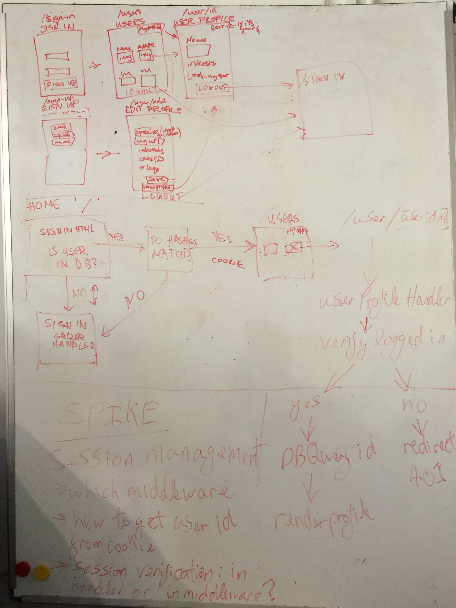

# interstellar-soulmates  
It's a lonely universe out there.

# Background
This app was originally built as a 1.5 day sprint with @dangerdak and @polyccon, as part of week 8 of the [Founders and Coders bootcamp](https://foundersandcoders.com/) during which we were learning the express framework amongst other things.
I made this fork of the app in order to continue playing with it and improving it. In particular I aim to:

- [ ] fix buggy authorisation with express-session.

- [ ] improve test coverage.

## Why
Dating is hard for aliens.

## What
### User Stories
I should be able to: 
- [x] Sign up as a new user
- [x] Sign in as a registered user
- [x] Create and update my dating profile
- [x] View a page showing other users of the site
- [x] View the profiles of other users  
And: 
- [x] I shouldn't be able to view other users without logging in

### Stretch goals
- [ ] Ability to contact other users

## How
We started with some wireframing and whiteboarding the flow of our app. As
a group we created our file structure. We split in to pairs, trying to allow
people to work on the things they felt less confident with.

### Whiteboarding

